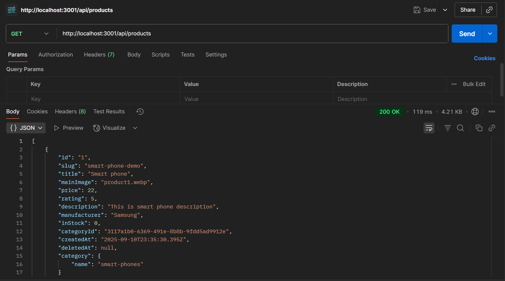
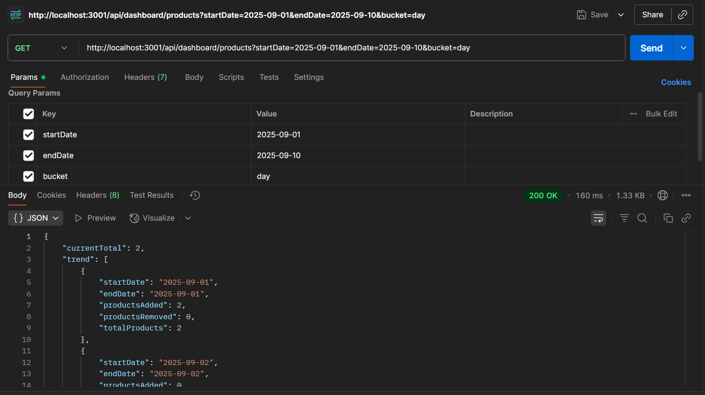
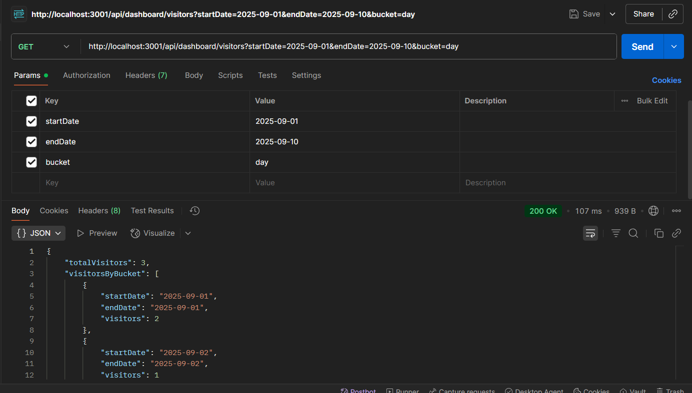

# Implementation of Analytics Features for Academy-Ease ecom-evalauation-app

## Approach

This implementation adds analytics tracking for products and visitors to support dashboard reporting features. Two new MySQL tables (`product_trends` and `visitor_logs`) were created and integrated with API endpoints to provide aggregated insights with flexible date range and bucket filters.

---

## Database Schema Changes

### product_trends

Tracks product addition and removal events for analytics.

```
model ProductTrend {
id Int @id @default(autoincrement())
productId Int
action String // "added" or "removed"
count Int
trendDate DateTime
}
```

Equivalent MySQL Table:

```
CREATE TABLE ProductTrend (
id INTEGER NOT NULL AUTO_INCREMENT,
productId INTEGER NOT NULL,
action VARCHAR(191) NOT NULL,
count INTEGER NOT NULL,
trendDate DATETIME(3) NOT NULL,
PRIMARY KEY (id)
);
```

### visitor_logs

Records visitor sessions to track site traffic.

```
model VisitorLog {
id Int @id @default(autoincrement())
sessionId String
userAgent String?
ip String?
visitDate DateTime
}
```

Equivalent MySQL Table:

```
CREATE TABLE VisitorLog (
id INTEGER NOT NULL AUTO_INCREMENT,
sessionId VARCHAR(191) NOT NULL,
userAgent VARCHAR(191) NULL,
ip VARCHAR(191) NULL,
visitDate DATETIME(3) NOT NULL,
PRIMARY KEY (id)
);
```

---

## API Endpoints

### GET /dashboard/products

#### Query Parameters

- `startDate` (optional, format YYYY-MM-DD)
- `endDate` (optional, format YYYY-MM-DD)
- `bucket` (optional: `day`, `week`, or `month`)

#### Response

Returns total current products and array of trend data buckets with:

- `startDate` and `endDate` of the bucket
- `totalProducts` at the end of the bucket period
- Number of `productsAdded` and `productsRemoved`

Sample:

```
{
"currentTotal": 128,
"trend": [
{
"startDate": "2025-09-01",
"endDate": "2025-09-01",
"totalProducts": 120,
"productsAdded": 5,
"productsRemoved": 2
},
...
]
}
```

### GET /dashboard/visitors

#### Query Parameters

- `startDate` (optional, YYYY-MM-DD)
- `endDate` (optional, YYYY-MM-DD)
- `bucket` (optional: `day`, `week`, or `month`)

#### Response

Returns total visitors count and visitor counts grouped by buckets.

Sample:

```
{
"totalVisitors": 452,
"visitorsByBucket": [
{
"startDate": "2025-09-01",
"endDate": "2025-09-01",
"visitors": 120
},
...
]
}
```

---

## Bucket-Filtering Logic

- Buckets group data by the selected period: day (single date), week (Monday to Sunday), or month (calendar month).
- Backend uses `date-fns` library to calculate bucket boundaries.
- Data entries (`product_trends.trendDate`, `visitor_logs.visitDate`) are aggregated based on these buckets.
- The API ensures that each bucket returns both `startDate` and `endDate` fields as required.

---

## Logging Product and Visitor Events

### Product Event Logging

- When products are created, a record with action `"added"` is inserted into `product_trends`.
- When products are deleted, a record with action `"removed"` is logged before deletion.
- Example snippet from `createProduct` controller:

```
await prisma.productTrend.create({
data: {
productId: product.id,
action: 'added',
count: 1,
trendDate: new Date(),
},
});
```

- Example snippet from `deleteProduct` controller:

```
await prisma.productTrend.create({
data: {
productId: parseInt(id),
action: 'removed',
count: 1,
trendDate: new Date(),
},
});
```

### Visitor Logging Middleware

- Middleware `logVisitor.js` captures visit details on public API routes.
- Logs session ID, user agent, IP address, and visit timestamp in `visitor_logs`.
- Applied to relevant public-facing routes using `app.use()` in `server/app.js`.



---

## How to Run and Test

1. Run migration:

```
cd server
npx prisma migrate dev --name add_product_trend_and_visitor_log
npx prisma migrate dev --name add_createdAt_to_product
npx prisma migrate dev --name add_deletedAt_to_product
npx prisma generate
```

2. Seed data in tables for preliminary tests.
```
npm run seed
```

3. Start the server:

```
node app.js
```

4. Test APIs via Postman or curl with various `startDate`, `endDate`, `bucket` params.
- API Test Result: Products



- API Test Result: Visitors




---

Thank you for reviewing this implementation. Please reach out for any clarifications.

